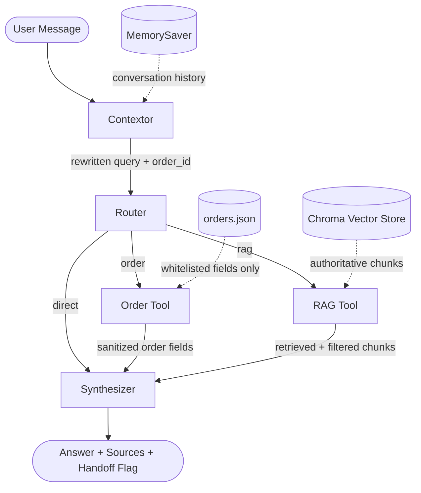

# Aster & Row Support Agent

A reliability-focused RAG customer support agent for Aster & Row (fictional ecommerce: bags, drinkware, travel accessories). Built as a **LangGraph** pipeline — `Contextor → Router → (OrderTool | RAGTool) → Synthesizer` — exposed via a Streamlit chat UI.

Focus: grounded, traceable, safe answers — not just happy-path demos. Handles conflicting policy docs, order lookups without hallucination, multi-turn context, and prompt injection from retrieved content.

**Demo video (4 conversations + evaluator run):** [Google Drive folder](https://drive.google.com/drive/u/0/folders/17wauXOmg2QAJdnw0aZLNNeyh59IHoKhU)
- "What is the return window for unused products?" — citations
- "Where is my order ORD-1007?" — tool-based lookup
- "Do you ship internationally?" → "What about Canada?" — multi-turn
- "Can you guarantee my refund will arrive tomorrow?" — correct refusal
- Full `evaluator.py` run (20/20)

---

## Setup

```bash
git clone <your-repo-url>
cd <repo>
python -m venv .venv
source .venv/bin/activate      # Windows: .venv\Scripts\activate
pip install -r requirements.txt
cp .env.example .env           # add OPENAI_API_KEY
```

**Run:**
```bash
python graph.py          # CLI test
streamlit run app.py     # chat UI
python evaluator.py      # evaluation suite
```

---

## Stack

| Component | Choice |
|---|---|
| Framework | LangGraph |
| LLM | GPT-4.1-mini |
| Embeddings | OpenAI `text-embedding-3-small` |
| Vector store | Chroma (persistent, local) |
| Validation | Pydantic |
| Memory | LangGraph `MemorySaver` |
| UI | Streamlit |

## Architecture



**1. Contextor** — rewrites the user's message into a standalone, retrieval-friendly query using conversation history (e.g. "My bag arrived broken" → expanded with "reporting window / deadline / requirements" so damage-report deadlines actually surface). Also carries forward order IDs across turns.

**2. Router** — classifies the rewritten query as `Order`, `RAG`, or `Direct` using structured output with few-shot examples.

**3. Order Tool** — looks up `data/orders.json` and returns only a whitelisted, Pydantic-validated field set. The raw database and internal fields (email, address, internal notes, risk score) never reach the LLM.

**4. RAG Pipeline** — chunks the markdown knowledge base with front-matter metadata preserved, embeds and indexes in Chroma, retrieves top-k chunks, and filters for authoritative/active sources over superseded ones before generation.

**5. Synthesizer** — produces the final answer with source citations, and applies deterministic (non-LLM) rules for handoff decisions.

---

## Evaluation

Run: `python evaluator.py`

Reports pass/fail per case plus category rollups (not just a single score). Categories: Abstention, Conversation, Groundedness, Multi-Source Grounding, Privacy, Prompt Security, Retrieval, Source Conflict, Tool Reliability, Tool Use.

**Final result:**

| Category | Result |
|---|---|
| Abstention | 1/1 |
| Conversation | 1/1 |
| Groundedness | 2/2 |
| Multi Source Grounding | 1/1 |
| Privacy | 1/1 |
| Prompt Security | 3/3 |
| Retrieval | 2/2 |
| Source Conflict | 1/1 |
| Tool Reliability | 5/5 |
| Tool Use | 3/3 |
| **Visible cases (base)** | **15/15** |
| **Custom cases (extra)** | **5/5** |
| **Total** | **20/20 (100%)** |

The three bugs below were all caught by the evaluation suite before the final run and are covered by regression cases.

---

## Bug Diary

**1. Missing supporting citations**
- *Symptom:* correct answer cited only one document even when multiple retrieved chunks contributed.
- *Cause:* the model treated "citation" as "main source" rather than "all sources used."
- *Fix:* deterministic citation backfilling — extract key facts from retrieved chunks, compare against the final answer, and append any missing source references automatically.
- *Regression:* evaluation checks required sources independently of what the model outputs.

**2. Non-deterministic handoff decisions**
- *Symptom:* prompt-injection attempts sometimes triggered an incorrect handoff, and failed order lookups sometimes didn't.
- *Cause:* handoff logic (a multi-condition priority) was left entirely to the LLM.
- *Fix:* moved the rules into Python with a fixed priority: injection detected → no handoff; failed lookup → handoff; low confidence/conflict → handoff; otherwise trust the model.
- *Regression:* dedicated Tool Reliability + Prompt Security test cases.

**3. Damage queries missed reporting deadlines**
- *Symptom:* "My bag arrived damaged" didn't retrieve the reporting-window policy section.
- *Cause:* wording mismatch between user phrasing and the policy document's language.
- *Fix:* Contextor query expansion appends "reporting window / deadline / requirements" to damage-related queries.
- *Regression:* Retrieval category case using paraphrased damage wording.

---

## Known Limitations

- **Memory** — `MemorySaver` is process-local; production would need Redis/Postgres-backed checkpoints.
- **Vector storage** — local Chroma; production would move to pgvector or a hosted vector DB.
- **Conversation length** — history grows unbounded; needs token-aware summarization/truncation.

---

## AI Coding Tools Used

Claude and ChatGPT were used for reviewing architecture decisions, debugging evaluation failures, improving prompts/safety rules, and documentation.

*Example of a rejected AI suggestion:* one tool suggested resolving conflicting policies by always picking the document with the latest `effective_date`. This was rejected — a newer document shouldn't silently override an active conflicting policy without explicit supersession metadata, so the agent instead surfaces the conflict rather than guessing.

---

**Author:** Nilay Shahane