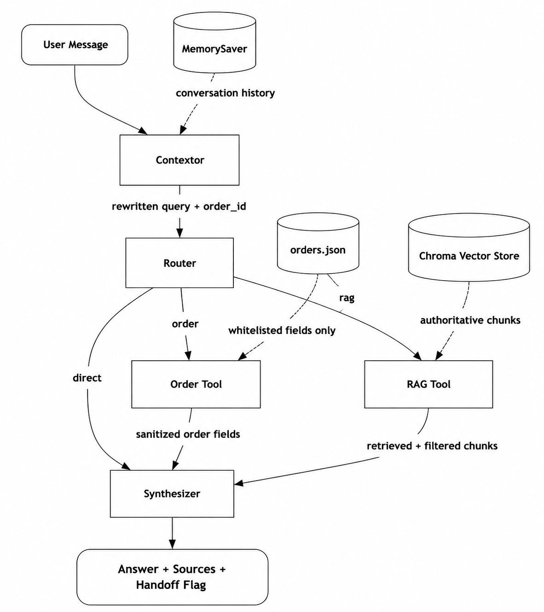

# Aster & Row Support Agent

A reliability-focused RAG support agent for Aster & Row, an ecommerce company selling bags, drinkware, and travel accessories. The system combines semantic retrieval, source-authority ranking, tool calling, conversation memory, and deterministic safeguards to deliver accurate, grounded, and traceable support responses.

It is designed to prioritize reliable knowledge retrieval, authoritative sources, accurate order information, contextual conversations, and safe handling of untrusted content, with an evaluation suite used to validate the agent's behavior across realistic support scenarios.

---

## 1. Setup and Run Instructions (clean clone)

```bash
git clone https://github.com/Nilay-Shahane/aster-row-support-agent
cd aster-row-support-agent

# create and activate a virtual environment
python -m venv .venv
# Windows:
.venv\Scripts\Activate.ps1
# macOS/Linux:
source .venv/bin/activate

# install dependencies
pip install -r requirements.txt

# configure environment variables
cp .env.example .env
# edit .env and set OPENAI_API_KEY

# move into src (all package imports are rooted here)
cd src

# build the Chroma vector store (run once, or after any knowledge-base/chunker change)
python -m rag.vectorstore

# run the agent (Streamlit chat UI) — takes about 5 seconds to load
streamlit run app.py
```

To run the evaluation suite instead of the chat UI:

```bash
# from src/
python evaluator.py
```

---

## 2. Environment Variables

`.env.example`:

```
OPENAI_API_KEY=
```

Only `OPENAI_API_KEY` is read from the environment (via `Embedder` in `rag/embedder.py`). The LLM model name (`gpt-4.1-mini`) and the Chroma persistence path are currently hardcoded in `llm.py` and `vectorstore.py` respectively, not environment-configurable.

---

## 3. Model, Embedding, Framework, Storage

| Choice | What | Why |
|---|---|---|
| LLM | OpenAI `gpt-4.1-mini` via `langchain_openai.ChatOpenAI`, temperature=0, max_tokens=512 | Structured-output support (`with_structured_output`) for each graph node, low latency, temp=0 minimizes run-to-run phrasing variance. |
| Embeddings | OpenAI `text-embedding-3-small` (1536-dim), hosted | Strong retrieval quality with a single-provider setup; batched via the `Embedder` wrapper. |
| Framework | LangGraph `StateGraph` with `MemorySaver` checkpointing | The workflow is a multi-node graph (Contextor → Router → OrderTool/RAGTool → Synthesizer) with per-thread conversational memory, not a single bounded loop. |
| Vector storage | Local persistent ChromaDB collection (cosine space) | Handles upsert-by-chunk-id, metadata filtering (`authoritative` flag), and similarity search without a hosted vector DB. |

---

## 4. Architecture



### File Map

| File | Role |
|---|---|
| `src/graph.py` | Builds and compiles the LangGraph `StateGraph`; wires Contextor → Router → (OrderTool \| RAGTool \| direct) → Synthesizer. |
| `src/agents/contextor.py` | Rewrites the latest user message into a self-contained query using conversation history; extracts/carries forward the active Order ID. |
| `src/agents/router.py` | Classifies the rewritten query into `order`, `rag`, or `direct` and extracts an Order ID if present. |
| `src/agents/synthesizer.py` | Builds the system prompt with `[ORDER DATA]`/`[KNOWLEDGE BASE]` context, calls the LLM for structured output, and applies deterministic handoff-precedence and source-validation logic. |
| `src/tools/order_lookup.py` | Deterministic, side-effect-free order lookup against `orders.json`; returns a whitelisted `SafeOrder` schema. |
| `src/tools/rag_lookup.py` | Queries the Chroma vector store for the top-k relevant chunks for the current query. |
| `src/rag/loader.py`, `src/rag/parser.py` | Reads KB markdown files and parses YAML front matter + body into `ParsedDocument` objects. |
| `src/rag/chunker.py` | Splits documents by `##` heading into `Chunk` objects; extracts bolded `key_facts` for deterministic grounding checks. |
| `src/rag/embedder.py` | Wraps the OpenAI embeddings API for batch (ingest) and single-query embedding. |
| `src/rag/vectorstore.py` | ChromaDB-backed vector store; upsert, cosine-similarity top-k query, authoritative-only filtering by default. |
| `src/schemas/graph_state.py`, `contextor_output.py`, `router_output.py`, `synthesizer_output.py`, `safe_order.py` | Pydantic/TypedDict schemas shared across graph nodes. |
| `src/app.py` | Streamlit chat UI; shows route, confidence, handoff, injection flags, cited sources, and a per-turn trace expander. |
| `src/evaluator.py` | Deterministic + heuristic eval harness; category-level reporting. |
| `src/evaluation/cases_custom.json` (or equivalent) | 5 original test cases beyond the supplied visible cases. |

---

## 5. Running Evaluations

```bash
cd src
python evaluator.py
```

This runs all 20 cases: 15 from the supplied `visible-cases.json` plus 5 original custom cases.

---

## 6. Baseline and Final Evaluation Results

**Baseline** — early integration run, before the deterministic-handoff backstops and prompt refinements described in the bug diary:

| Category | Passed |
|---|---|
| retrieval | 1/2 |
| groundedness | 0/2 |
| multi-source-grounding | 0/1 |
| conversation | 0/1 |
| tool-use | 0/3 |
| tool-reliability | 0/5 |
| privacy | 1/1 |
| prompt-security | 0/3 |
| abstention | 0/1 |
| source-conflict | 0/1 |
| **TOTAL** | **2/20** |

**Final** — after the fixes below, run against all 15 supplied visible cases + all 5 original custom cases:

| Category | Passed |
|---|---|
| retrieval | 2/2 |
| groundedness | 2/2 |
| multi-source-grounding | 1/1 |
| conversation | 1/1 |
| tool-use | 3/3 |
| tool-reliability | 5/5 |
| privacy | 1/1 |
| prompt-security | 3/3 |
| abstention | 1/1 |
| source-conflict | 1/1 |
| **TOTAL** | **20/20** |

---

## 7. Bug Diary

**Bug 1 — Supporting source was not cited when another source was sufficient**
- *Reproduced by:* the `final-sale-damaged-exception` evaluation case. The answer was correctly grounded, but the model cited only the source it directly relied on, even though both `03-final-sale-and-promotions.md` and `04-damaged-or-wrong-items.md` contained relevant supporting information.
- *Root cause:* the LLM treated citations as "sources used to formulate the answer" rather than "all relevant authoritative sources retrieved." Since one document was sufficient, it omitted the other.
- *Fix:* strengthened the synthesizer system prompt (Rule 11) to require every chunk id whose fact appears anywhere in the answer, plus a deterministic `_backfill_sources_from_key_facts` pass that scans the answer for each retrieved chunk's bolded `key_facts` and adds any source the model's own `sources_used` missed.
- *Regression:* reran `final-sale-damaged-exception` and verified the response cites both the final-sale and damaged/wrong-item sections while still giving the correct 7-calendar-day requirement.

**Bug 2 — KB content overrode tool results**
- *Reproduced:* an order with no delivery estimate received a generic KB delivery-time range instead.
- *Cause:* the model had both the specific order-tool result and general shipping-policy content, with no explicit precedence rule.
- *Fix:* added synthesizer Rule 10 — `status` and tool-provided fields are authoritative for the order; if `estimated_delivery` is missing, state plainly that no estimate is available rather than inferring one from KB content.
- *Regression:* custom eval requires no invented arrival date and requires the "delivery estimate unavailable" response.

**Bug 3 — Abstention backstop caused false handoffs**
- *Reproduced:* a custom order/coupon case incorrectly returned `handoff=True` even though the agent correctly handled the tool result.
- *Cause:* the deterministic handoff-precedence logic set `handoff=True` whenever confidence wasn't `"grounded"`, without accounting for a successful tool call.
- *Fix:* precedence order in `synthesizer_node` now only forces `handoff=True` deterministically for a failed order lookup or `confidence in {"insufficient", "conflicting"}`; a successful tool call with a complete answer is trusted. Privacy and action/manual-review cases (e.g. damaged items, PII requests) are still left to the LLM's own `handoff` classification rather than a hard-coded rule — see Known Limitations.
- *Regression:* custom regression case confirms `handoff=False` for the order/coupon case.

---

## 8. Known Limitations

- **Source backfill is string-matching, not semantic** — `_backfill_sources_from_key_facts` only catches a missed citation if the bolded fact appears in the answer in near-identical wording (after light normalization); a paraphrased fact can still slip through uncited.
- **Handoff is not fully deterministic for all cases** — the code hard-enforces `handoff` only for injection detection, failed order lookups, and `insufficient`/`conflicting` confidence. Privacy and action/manual-review cases (e.g. damaged-item reports, requests for PII) rely on the LLM's own `handoff` output rather than a code-level check, so it can occasionally get this wrong.
- **`MemorySaver` is in-memory only, not a real database** — conversation state lives only in process memory via LangGraph's `MemorySaver` checkpointer. It does not persist across restarts and won't scale across multiple instances. Production would need a persistent checkpointer backed by an actual database (e.g. a Postgres- or SQLite-backed checkpointer).

---

## 9. AI Coding Tools Used

Claude and ChatGPT were used throughout for: reviewing modules against the assignment requirements, diagnosing evaluation failures using trace logs and test evidence, writing and revising implementation fixes, and refining the README.

**Example of a corrected AI suggestion:** during debugging, an AI assistant suggested that a retrieval issue was caused by the conflict-detection threshold and recommended changing `min_score`. Instead of applying the change immediately, retrieval scores were checked against the trace logs, and the evidence pointed to a different root cause. This reinforced the project's debugging approach: **verify against trace-log and evaluation evidence before changing code.**

---

## 10. Demo

🎥 **Demo:**

For the full walkthrough with audio, watch the video here: [Google Drive](https://drive.google.com/drive/u/0/folders/17wauXOmg2QAJdnw0aZLNNeyh59IHoKhU).

The demo demonstrates:
- One knowledge-base question with citations.
- One order lookup.
- One multi-turn conversation.
- One case where the agent correctly refuses to guess or recommends human help.
- The evaluation suite running (20/20 cases passed).